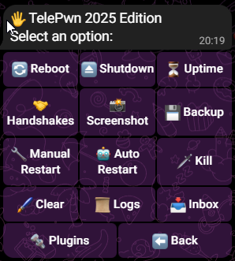

# TelePwn v2.0

> Control your Pwnagotchi via Telegram - Python 3.13 Compatible

[](https://www.python.org/)
[](https://github.com/python-telegram-bot/python-telegram-bot)
[](LICENSE)

## 🎥 See It in Action


## ✨ Features

- 📱 **Full Remote Control** - Manage your Pwnagotchi from anywhere via Telegram
- 🤝 **Auto-Send Handshakes** - .pcap files automatically sent to Telegram (cloud backup!)
- 📸 **Screenshot Sharing** - Take and share screenshots with the community
- 🎉 **Milestone Celebrations** - Unlock achievements at 100, 500, 1K, 5K, 10K handshakes
- 🔄 **System Management** - Reboot, shutdown, restart modes, view stats
- 📊 **Live Monitoring** - Uptime, handshakes, CPU, memory, temperature
- 🔌 **Plugin Control** - Enable/disable plugins remotely

## 📦 Quick Install

```bash
cd /tmp
sudo wget https://raw.githubusercontent.com/wpa-2/Pwnagotchi-Plugins/refs/heads/main/TelePwn/install_telepwn.sh
sudo bash install.sh
```

The installer will:
- ✅ Detect and remove old versions automatically
- ✅ Install Python 3.13 compatible dependencies
- ✅ Guide you through bot setup
- ✅ Configure community features (optional)

## 🎯 What You Get

### Handshake Notifications
Every time you capture a handshake:
```
🤝 New handshake: HomeWiFi - aa:bb:cc:dd:ee:ff

📎 HomeWiFi_aabbccddeeff.pcap [45 KB]
```
Download the .pcap directly from Telegram!

### Bot Commands
```
/start or /menu    Main menu with buttons
/help             Show all commands
/screenshot       Take screenshot
/handshakes       Handshake count
/uptime           System uptime
/stats            CPU, memory, temperature
/backup           Create and send backup
/plugins          Manage plugins
/reboot           Reboot device
```

All commands include back buttons - no typing needed!

## ⚙️ Configuration

Edit `/etc/pwnagotchi/config.toml`:

```toml
[main.plugins.telepwn]
enabled = true
bot_token = "YOUR_BOT_TOKEN"              # Get from @BotFather
chat_id = "YOUR_CHAT_ID"                  # Get from @userinfobot
send_message = true                        # Enable notifications
send_handshake_file = true                 # Auto-send .pcap files
auto_start = true                          # Start bot automatically
community_enabled = false                  # Optional: Enable sharing
community_chat_id = "@Pwnagotchi_UK_Chat" # Optional: Your group/channel
```

### Getting Your Bot Token
1. Message [@BotFather](https://t.me/BotFather) in Telegram
2. Send `/newbot` and follow prompts
3. Copy the token

### Getting Your Chat ID
1. Message [@userinfobot](https://t.me/userinfobot) in Telegram
2. Copy your ID number

## 🌟 Community Features

Join the UK Pwnagotchi community and:
- Share screenshots with other Pwnagotchi users
- Celebrate milestone achievements together
- Connect with the community

**Privacy:** Completely opt-in. You control what gets shared.

**Join:** [https://t.me/Pwnagotchi_UK_Chat](https://t.me/Pwnagotchi_UK_Chat)

## 🔧 Manual Installation

```bash
# 1. Install dependencies
pip3 install python-telegram-bot pytz --upgrade --break-system-packages

# 2. Install plugin
sudo wget https://raw.githubusercontent.com/wpa-2/Pwnagotchi-Plugins/refs/heads/main/TelePwn/telepwn.py -O /usr/local/share/pwnagotchi/custom-plugins/telepwn.py

# 3. Configure (edit config.toml)
sudo nano /etc/pwnagotchi/config.toml

# 4. Restart
sudo systemctl restart pwnagotchi
```

## 🆙 Upgrading from v1.x

Just run the installer - it automatically detects and removes old versions:

```bash
sudo bash install.sh
```

Your existing configuration is preserved!

## 📝 Troubleshooting

**Bot not starting?**
```bash
sudo tail -f /etc/pwnagotchi/log/pwnagotchi.log | grep TelePwn
```

**Not receiving handshakes?**
- Check `send_message = true` in config
- Verify bot is running in logs

**Community sharing not working?**
- Set `community_enabled = true`
- Set `community_chat_id = "@YourChannel"`
- Make bot admin in channel

## 🔒 Privacy & Security

- Bot token: Keep it secret - anyone with it controls your bot
- Chat ID: Keep it private - prevents unauthorized access
- Handshake files: Contain WiFi capture data - handle securely
- Community sharing: Only share what you're comfortable making public

## 📊 What's New in v2.0

- ✅ Full Python 3.13 compatibility
- ✅ Auto-send handshake .pcap files to Telegram
- ✅ Configurable community chat (use your own channel)
- ✅ All commands include back buttons
- ✅ Better error handling throughout
- ✅ Headless mode support

## 🙏 Credits

**Author:** WPA2

**Community:** [UK Pwnagotchi](https://t.me/Pwnagotchi_UK_Chat)

## 📄 License

GPL v3 - Same as Pwnagotchi

---

**Made with ❤️ for the Pwnagotchi community**
